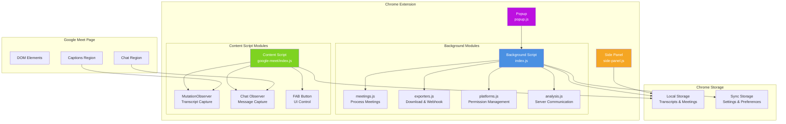
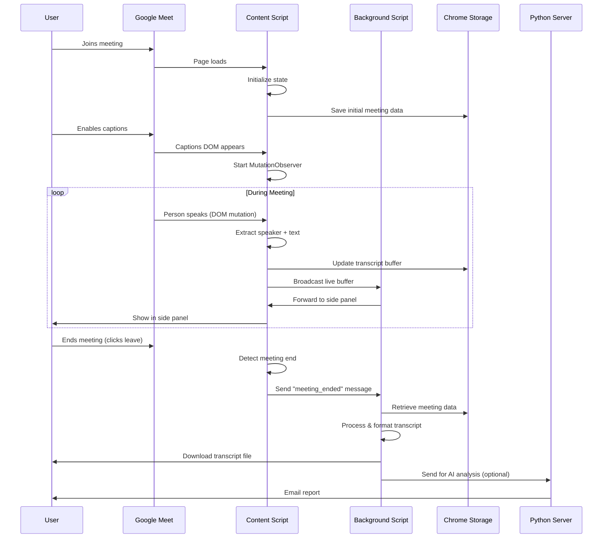
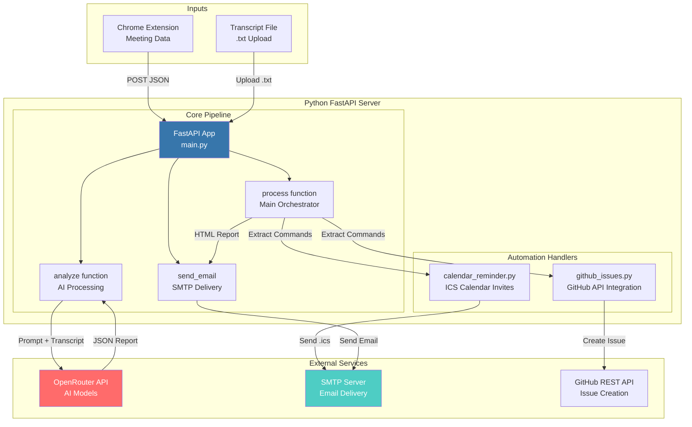
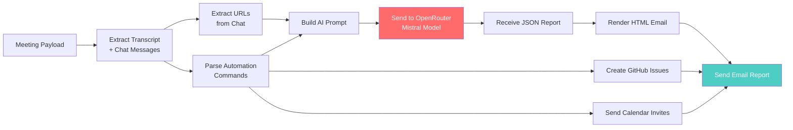
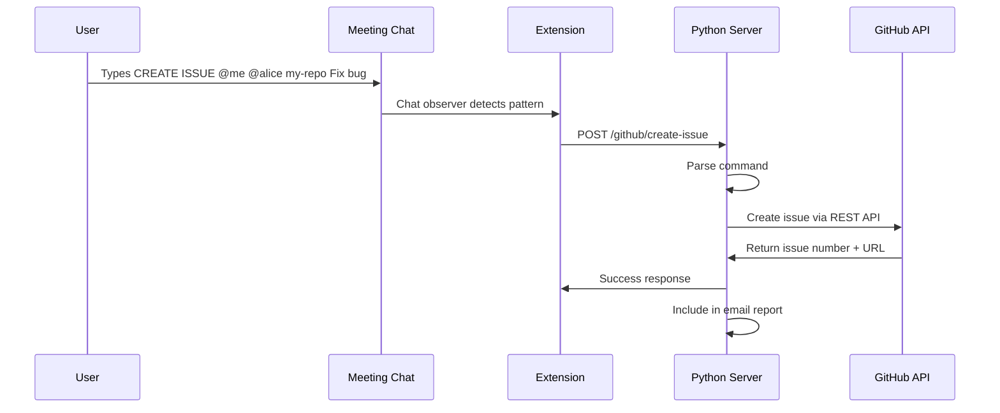
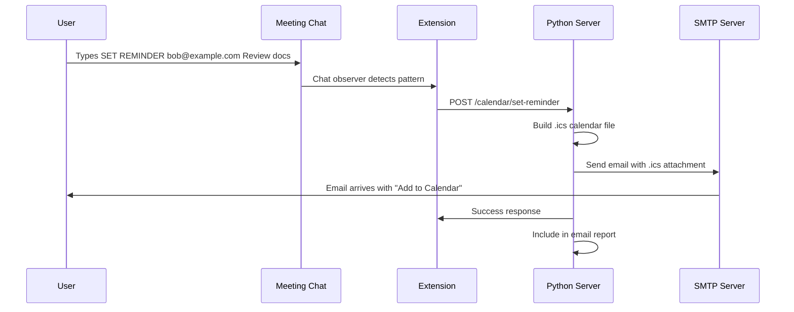

# Transcriber - Meeting Transcript & AI Analysis System

A Chrome extension + Python server combo that captures meeting transcripts from Google Meet, analyzes them with AI, and sends intelligent email reports.

---

## 📋 Table of Contents

- [Overview](#overview)
- [Extension Working](#extension-working)
  - [Architecture Diagram](#extension-architecture-diagram)
  - [Components](#extension-components)
  - [Data Flow](#extension-data-flow)
  - [Key Features](#extension-key-features)
- [Server Working](#server-working)
  - [Architecture Diagram](#server-architecture-diagram)
  - [Endpoints](#server-endpoints)
  - [AI Analysis](#ai-analysis)
  - [Automation Commands](#automation-commands)
- [Installation](#installation)
- [Configuration](#configuration)

---

## Overview

**Transcriber** is a privacy-focused meeting productivity tool with two main components:

1. **Chrome Extension** - Captures real-time transcripts and chat messages from Google Meet
2. **Python Server** - Analyzes transcripts with AI and sends structured email reports

The system works completely offline by default (transcripts saved locally), with optional AI-powered email reports when the server is running.

---

## Extension Working

### Extension Architecture Diagram



### Extension Components

#### 1. **Background Script (Service Worker)**
- **index.js** - Central message router handling all extension events
- **meetings.js** - Processes completed meetings, manages storage
- **exporters.js** - Downloads transcripts, posts to webhooks
- **platforms.js** - Manages content script registration and permissions
- **analysis.js** - Sends meeting data to Python server for AI analysis
- **utils.js** - Helper functions for formatting and storage operations

#### 2. **Content Script**
Injected into Google Meet pages to capture real-time data:

- **MutationObserver** - Watches caption DOM changes for transcript capture
- **Chat Observer** - Monitors chat messages for text and automation commands
- **FAB Button** - Floating action button for quick side panel access
- **State Management** - Maintains meeting state (transcript buffer, participants, timestamps)

#### 3. **Side Panel**
Real-time transcript viewer with:
- Live transcript display as people speak
- Editable meeting title
- Auto-scroll with threshold detection
- Chrome storage sync for persistence

#### 4. **Popup**
Quick settings panel with:
- Enable/disable Google Meet capture
- Auto/manual caption mode toggle
- Hide captions option
- Version display

### Extension Data Flow



### Extension Key Features

#### Real-Time Transcript Capture
```
1. Content script detects captions button
2. Waits for captions region to appear in DOM
3. Attaches MutationObserver to transcript container
4. Captures speaker name + text + timestamp on each mutation
5. Buffers text per speaker to handle Google Meet's incremental updates
6. Pushes completed blocks to Chrome storage
```

#### Smart Speaker Detection
- Tracks `mutationTargetElement` to identify speaker changes
- Buffers text until speaker changes or meeting ends
- Handles edge case: Google Meet drops long transcripts (>30 min), auto-splits

#### Automation Commands (Chat-Based)
Users can type special commands in meeting chat:

- **`CREATE ISSUE @me @username repo-name title`** - Creates GitHub issue
- **`SET REMINDER email@address description`** - Sends calendar invite

These are detected by the chat observer and sent to the Python server.

#### Meeting Recovery
- If extension crashes or tab closes unexpectedly, recovery system attempts to save last meeting
- Checks storage for unprocessed meetings on next initialization

---

## Server Working

### Server Architecture Diagram



### Server Endpoints

| Endpoint | Method | Purpose |
|----------|--------|---------|
| `/api/meetings/analyze` | POST | Analyze meeting from extension (JSON payload) |
| `/api/meetings/analyze-file` | POST | Analyze uploaded .txt transcript file |
| `/github/create-issue` | POST | Create GitHub issue from command |
| `/calendar/set-reminder` | POST | Send calendar invite from command |
| `/health` | GET | Health check |

### AI Analysis Pipeline



#### AI Report Structure
The AI generates a structured JSON report with:

- **Summary** (2-4 sentences) - What was discussed, outcomes, tone
- **Key Points** (3-7 items) - Most important discussion points
- **Decisions** - Explicitly agreed conclusions
- **Action Items** - Tasks with owner, action, due date
- **Risks & Open Questions** - Unresolved issues
- **Insights** - Higher-level observations about meeting quality

#### Prompt Engineering Strategy
The server uses strict prompt rules to prevent hallucination:
- Never invent decisions/owners/dates not in transcript
- Use speaker names exactly as captured (e.g., "Alice", "Bob")
- Return empty arrays for fields with no relevant content
- Specific field definitions to ensure consistent structure

### Automation Commands

#### GitHub Issue Creation

**Trigger:** `CREATE ISSUE @me @username repo-name title`

**Flow:**


**Configuration Required:**
- `GITHUB_TOKEN` - Personal access token with repo scope
- `GITHUB_OWNER` - Default owner for repos without namespace

#### Calendar Reminder

**Trigger:** `SET REMINDER email@address description`

**Flow:**


**Strategy:** Uses iCalendar (.ics) attachments instead of Microsoft Graph API for universal compatibility (Gmail, Outlook, Apple Mail).

---

## Installation

### Chrome Extension

1. Open Chrome → `chrome://extensions/`
2. Enable "Developer mode"
3. Click "Load unpacked"
4. Select the `extension/` folder
5. Grant permissions when prompted

### Python Server

```bash
cd server

# Create virtual environment
python -m venv .venv
source .venv/bin/activate  # Windows: .venv\Scripts\activate

# Install dependencies
pip install -r requirements.txt

# Configure environment variables
cp .env.example .env
# Edit .env with your credentials

# Run server
uvicorn main:app --reload --port 8080
```

---

## Configuration

### Extension Settings (Chrome Storage)

| Setting | Type | Default | Description |
|---------|------|---------|-------------|
| `operationMode` | string | `"auto"` | `"auto"` (auto-enable captions) or `"manual"` |
| `wantGoogleMeet` | boolean | `true` | Enable Google Meet capture |
| `hideCaptions` | boolean | `false` | Hide captions UI while capturing |
| `autoDownloadFileAfterMeeting` | boolean | `true` | Auto-download transcript after meeting |
| `autoPostWebhookAfterMeeting` | boolean | `true` | Post to webhook URL |
| `webhookUrl` | string | `null` | Webhook endpoint for transcript data |
| `webhookBodyType` | string | `"simple"` | `"simple"` or `"advanced"` JSON format |
| `autoEmailReportAfterMeeting` | boolean | `true` | Send to analysis server |
| `analysisServerUrl` | string | `http://127.0.0.1:8080/api/meetings/analyze` | Python server URL |

### Server Environment Variables (.env)

```env
# AI Analysis
OPENROUTER_API_KEY=sk-or-...
OPENROUTER_MODEL=mistralai/mistral-small-3.1-24b-instruct

# Email Delivery
SMTP_HOST=smtp.gmail.com
SMTP_PORT=587
SMTP_USER=your-email@gmail.com
SMTP_PASSWORD=your-app-password
SMTP_FROM=your-email@gmail.com
REPORT_RECIPIENTS=recipient1@example.com,recipient2@example.com

# GitHub Integration
GITHUB_TOKEN=ghp_...
GITHUB_OWNER=your-username

# Calendar Reminders
REMINDER_OFFSET_HOURS=0
REMINDER_OFFSET_MINS=1
REMINDER_DURATION_MINS=30
```

---

## Privacy & Data Flow

1. **All transcripts stored locally** in Chrome storage (last 10 meetings)
2. **No external transmission** unless AI email reports enabled
3. **Server runs locally** by default (localhost:8080)
4. **AI analysis optional** - can be disabled in extension settings
5. **GitHub/Calendar commands** only execute when explicitly typed by user

---

## Tech Stack

**Extension:**
- Manifest V3 (Service Worker)
- Chrome APIs: storage, scripting, downloads, sidePanel
- Vanilla JavaScript (ES6 modules)
- MutationObserver for DOM monitoring

**Server:**
- FastAPI (Python web framework)
- OpenRouter (AI model aggregator)
- SMTP (email delivery)
- GitHub REST API (issue creation)
- iCalendar (calendar invites)

---

## Error Handling

The system uses error codes for debugging:

| Code | Description |
|------|-------------|
| 001-006 | Content script DOM errors |
| 008 | Extension status fetch failed |
| 009 | Download failed |
| 010 | Meeting not found in storage |
| 011 | Webhook post failed |
| 012 | Webhook URL not configured |
| 013 | No meetings in storage |
| 014 | Empty transcript |
| 015 | Invalid index |
| 016 | Recovery timeout |

All errors are logged anonymously to a Google Sheet for monitoring.

---
## Demo Video ( click to preview )
[](https://www.youtube.com/watch?v=ZgInScJIVqw)

### Team Members

- Vishal Kumar - 56026655
- Suman Hazra - 56026827
- Sanjana - 56026653
- Umesh Chandra - 56026826
## License

Open source, created by **Bit by Bit**.
